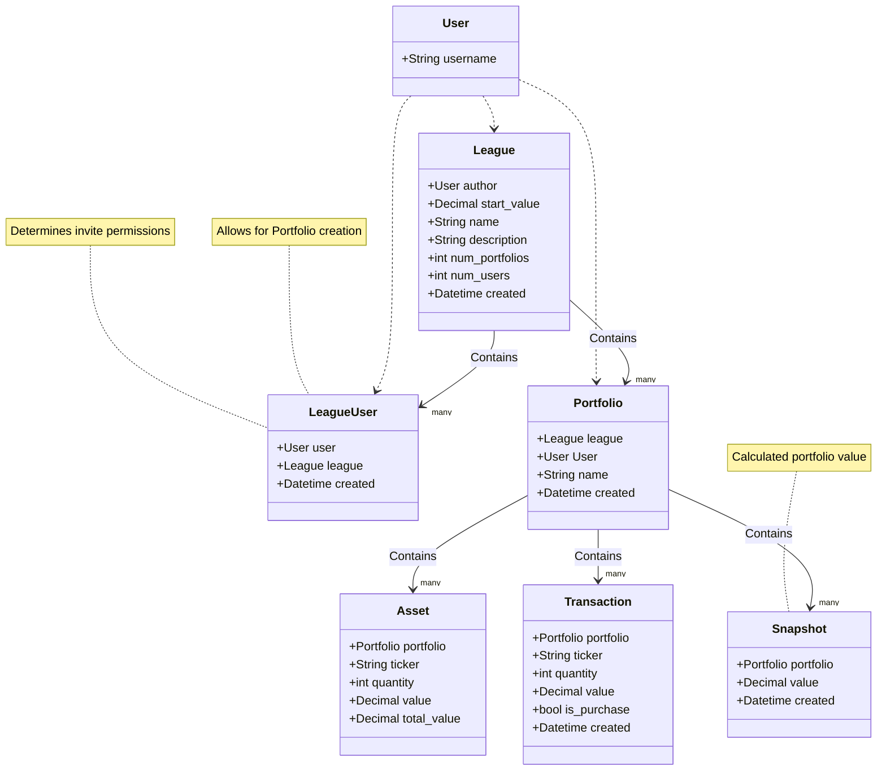

<div align="center">
    
    <h1> &dollar; Fantasy finance </h1>
</div>

## Local setup
```console
cp .env.template .env
docker compose up -d
docker exec -it [[CONTAINER_ID]] python manage.py migrate
docker exec -it [[CONTAINER_ID]] python manage.py createsuperuser
docker exec -it [[CONTAINER_ID]] python manage.py init
```

## Class diagram
