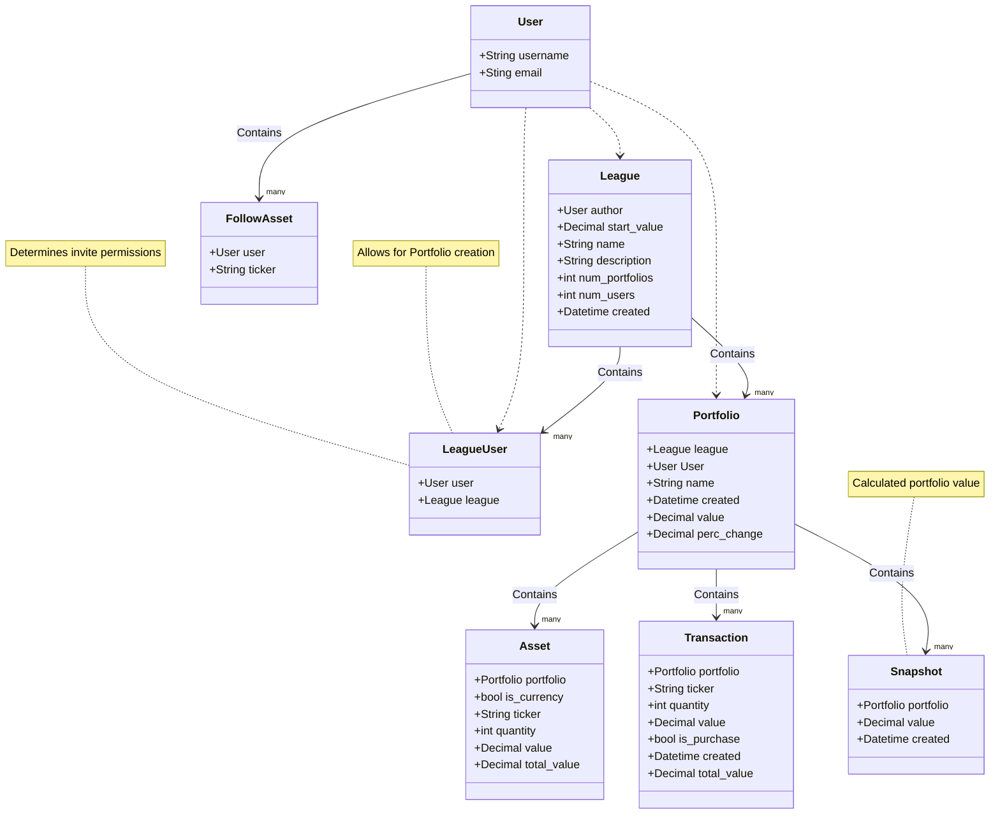

<div align="center">
    
    <h1>Fantasy Finance</h1>
</div>

## Local setup
```console
cp .env.template .env
vim .env
docker compose up -d
docker exec -it [[CONTAINER_ID]] /bin/sh
python manage.py migrate
python manage.py createsuperuser
python manage.py init
```

## Class diagram
