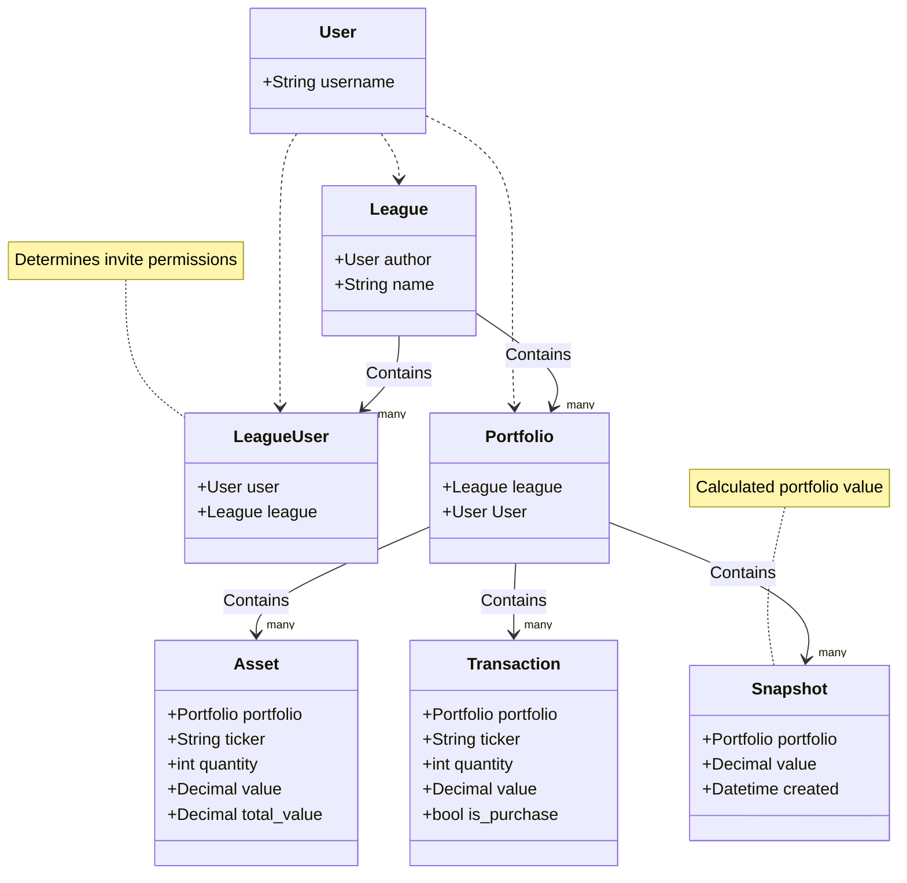

<div align="center">
    
    <h1> &dollar; Fantasy finance </h1>
</div>

## Local setup
```console
cp .env.template .env
docker compose up
```

## Class diagram

```mermaid
classDiagram
    class User {
        +String username
    }
    class League {
        +User author
        +String name
    }
    note for LeagueUser "Determines invite permissions"
    class LeagueUser {
        +User user
        +League league
    }
    class Portfolio {
        +League league
        +User User
    }
    note for Snapshot "Calculated portfolio value"
    class Snapshot {
        +Portfolio portfolio
        +Decimal value
        +Datetime created
    }
    class Asset {
        +Portfolio portfolio
        +String ticker
        +int quantity
        +Decimal value
        +Decimal total_value
    }
    class Transaction {
        +Portfolio portfolio
        +String ticker
        +int quantity
        +Decimal value
        +bool is_purchase
    }
    User ..> League
    User ..> LeagueUser
    User ..> Portfolio
    League --> "many" LeagueUser : Contains
    League --> "many" Portfolio : Contains
    Portfolio --> "many" Asset : Contains
    Portfolio --> "many" Transaction : Contains
    Portfolio --> "many" Snapshot : Contains
```